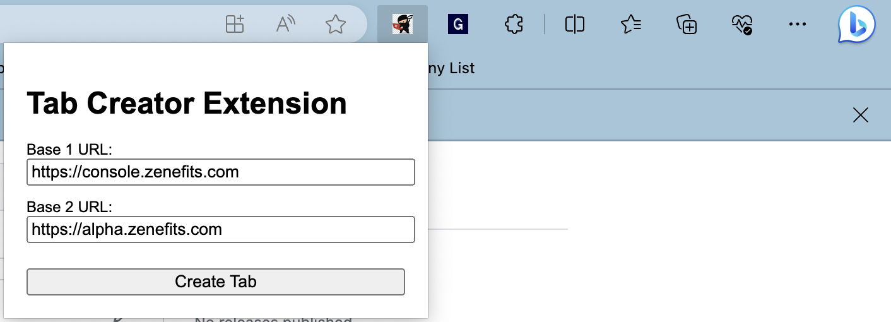
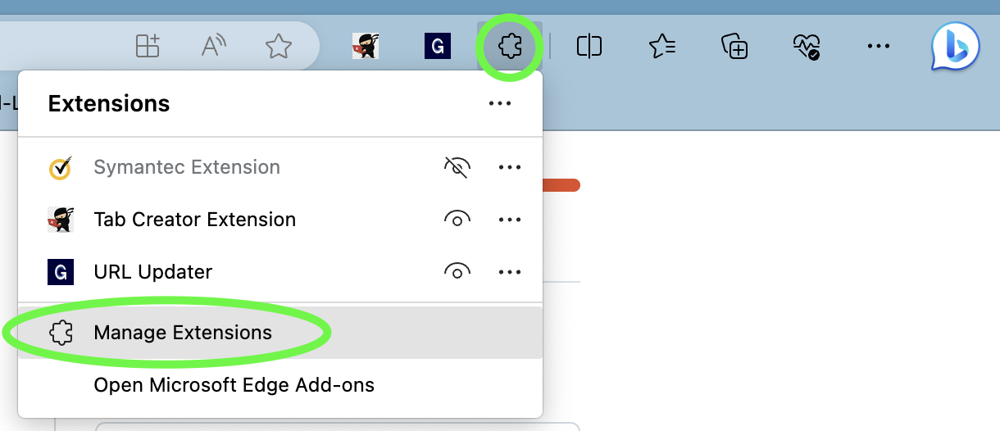
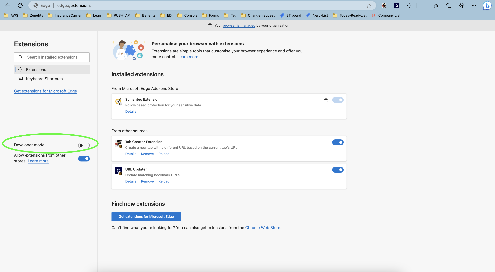
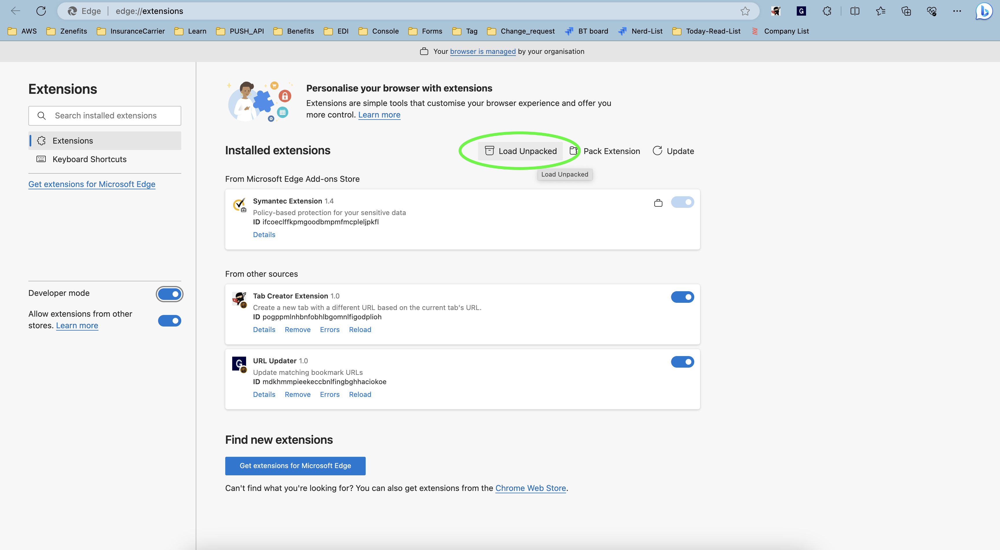
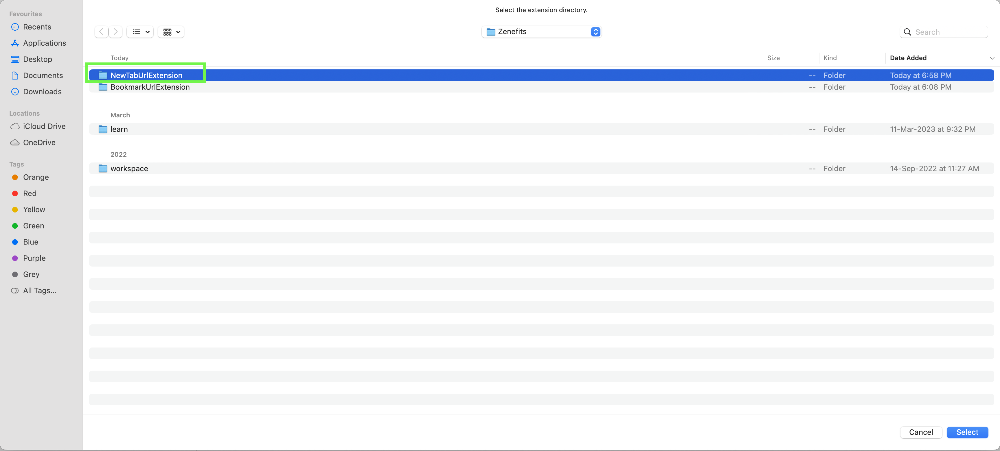

**What**
- Browser Extension to create a new tab based on the currently active tab with different base url.

**Why**
- We developers has to regularly check multiple console urls and many times to debug or check things on spoof/eng-spoof, we have to change the base url of console to the related spoof. Changing the url involves copy-pasting process multiple times. Using this extension we can change the base url and create a new tab with one click. This extension is suppose to increase the efficiency of our developers and remove the copy-pasting process.

**How to Install**
- This can be use in both edge and chrome. For installing we need to turn on the developer mode of browser.
    - Clone this repo, using git clone <git_url>
    - Click on Manage Extension button on edge
      
    - Turn on Developer Mode
      
    - Click on Load Unpacked
      
    - Select the folder where repo has been cloned
      
    - Hurray! your extension has been added.

**How to Use**
- For using this extension, we need to provide two urls
    - Base 1 url - default this will point to "https://console.zenefits.com"
    - Base 2 url - default this will point to "https://console.zenefits.com"

If Base 1 url matches with the base url of current active tab, if we click on 'Create tab' button, we will have new tab with the same url of current active tab but with Base 2 url.

- If we have currently active tab with this link - https://console.zenefits.com/console/company/119883 and
- Base 1 url is passed as https://console.zenefits.com and 
- Base 2 url is passed as https://gbarnwal-spoof-61650.dev.zncloud.net/ and 
- when we click on 'Create Tab' button, we will get a new tab with this url https://gbarnwal-spoof-61650.dev.zncloud.net/console/company/119883

